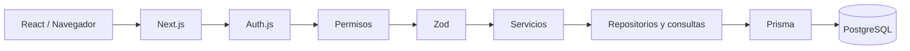

# Arquitectura

Server Components resuelven páginas y consultas seguras. Client Components aportan formularios e interacción. Server Actions reciben escrituras; Route Handlers entregan integraciones o exportaciones. Servicios aplican casos de uso y repositorios concentran Prisma. Véanse [[USUARIOS_ROLES_PERMISOS]] y [[BASE_DE_DATOS]].
