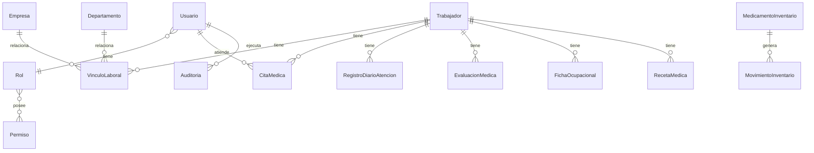

# Base de datos

Es un ERD conceptual, no un reemplazo de `schema.prisma`. `VinculoLaboral` representa la tabla mapeada por `AsignacionLaboral`. Véanse [[TRABAJADORES_Y_VINCULOS]], [[INVENTARIO]] y [[USUARIOS_ROLES_PERMISOS]].
