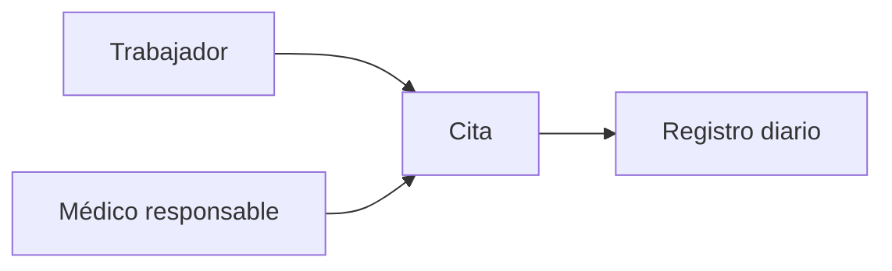

# Citas y atención

La cita conserva el médico responsable. El mismo médico o trabajador no puede tener citas solapadas. Varios médicos sí pueden atender en paralelo: 08:00 Ana–Pedro y 08:00 Juan–Carlos es válido; 08:00 Ana–Pedro y 08:15 Ana–Carlos es inválido si se superponen. Véanse [[FLUJO_CLINICO]] y [[USUARIOS_ROLES_PERMISOS]].
