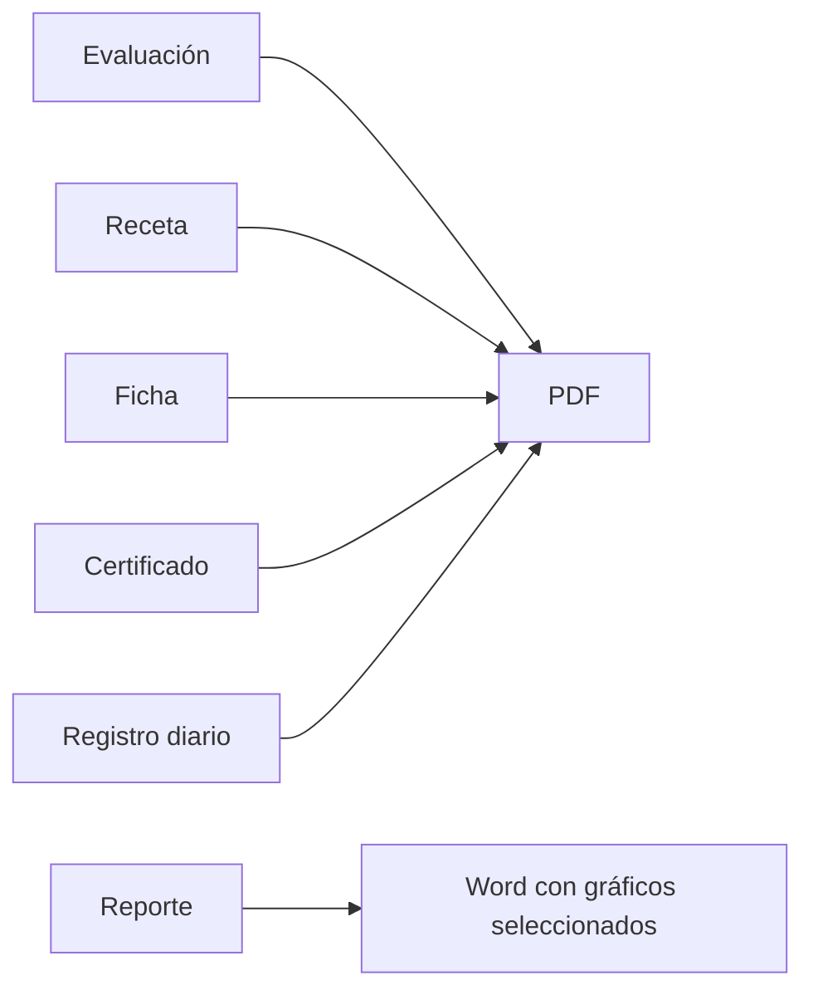

# Documentos y PDF

Receta, ficha ocupacional, certificado, evaluación y registro diario pueden generar PDF autorizado. Reportes genera un documento Word con los gráficos seleccionados por el usuario.

La acción visible se unifica como “Ver / imprimir PDF”. El resultado es un PDF real con `Content-Type: application/pdf`. Usa el médico responsable, firma cuando existe y contexto histórico persistido. Excel y PDF parten de datos autorizados, no de datos inventados. Véanse [[FLUJO_CLINICO]] y [[TRABAJADORES_Y_VINCULOS]].

Los reportes aplican el mismo período a todas sus secciones, gráficas y exportaciones. El período puede ser semanal, mensual o un rango personalizado inclusivo definido mediante fechas Desde/Hasta. La exportación Word conserva esos filtros, permite elegir los gráficos y captura su representación visible; el servidor revalida el acceso a los datos antes de generar el archivo.

Reportes no expone una vista previa PDF ni una descarga XLSX. La única acción documental del módulo es “Exportar a Word”, con selección explícita de gráficos, respuesta `.docx` sin caché y evento de auditoría.

La receta presenta los medicamentos en una tabla de ancho completo con las columnas Nombre, Dosis y Vía. Debajo muestra un único recuadro opcional de Indicaciones; no utiliza una columna separada de Tratamiento. La vista web y el PDF consolidan el mismo contenido persistido.

El certificado de evaluación médica ocupacional reproduce la estructura oficial en una sola hoja A4 horizontal: cuadrícula institucional, datos generales, aptitud, recomendaciones, declaración y espacios de firma. La vista web, el PDF y la configuración de impresión del XLSX usan la misma orientación y conservan los datos históricos persistidos en la ficha finalizada.

La exportación XLSX del certificado se genera con ExcelJS como un libro de Excel real y editable. Replica la hoja institucional `CERTIFICADO`, sus combinaciones, colores, bordes, dimensiones y área de impresión; no protege la hoja ni reemplaza las celdas por imágenes. Se alimenta del mismo DTO autorizado del certificado y, por tanto, conserva el contexto laboral y el profesional responsable almacenados históricamente en la ficha.

Los archivos clínicos individuales se entregan con un nombre uniforme y seguro que identifica el tipo de documento, el nombre completo histórico del trabajador y la fecha propia del documento. Cuando existe, también conserva el número interno del documento. Las exportaciones colectivas usan su sujeto real —fecha del registro diario, período del reporte o medicamento— porque no pertenecen a una sola persona.
