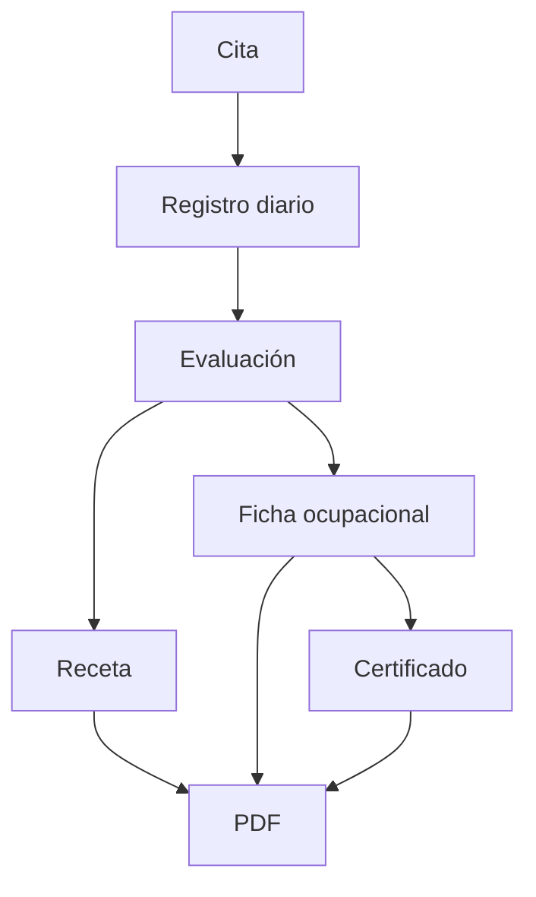

# Flujo clínico

Los borradores son editables; los documentos finalizados o emitidos son de solo lectura. Cada documento conserva médico responsable y contexto laboral históricos. Las operaciones relevantes se auditan. Véanse [[DOCUMENTOS_PDF]] y [[TRABAJADORES_Y_VINCULOS]].

La evaluación médica guarda la morbilidad escrita por el profesional. Los borradores históricos pueden conservarla vacía; para finalizar una evaluación nueva se debe ingresar una morbilidad. Los valores previamente guardados se ofrecen como sugerencias en evaluaciones futuras, sin impedir que el médico registre uno nuevo.

Finalizar una evaluación médica no crea una receta automáticamente. Desde la evaluación finalizada, un profesional con permiso puede iniciar voluntariamente una receta: el formulario se precarga con el contexto y los medicamentos, pero las indicaciones permanecen vacías y solo contienen lo escrito expresamente por el médico en la receta. El formulario permanece editable antes de guardarse o emitirse y este proceso no modifica el inventario.
