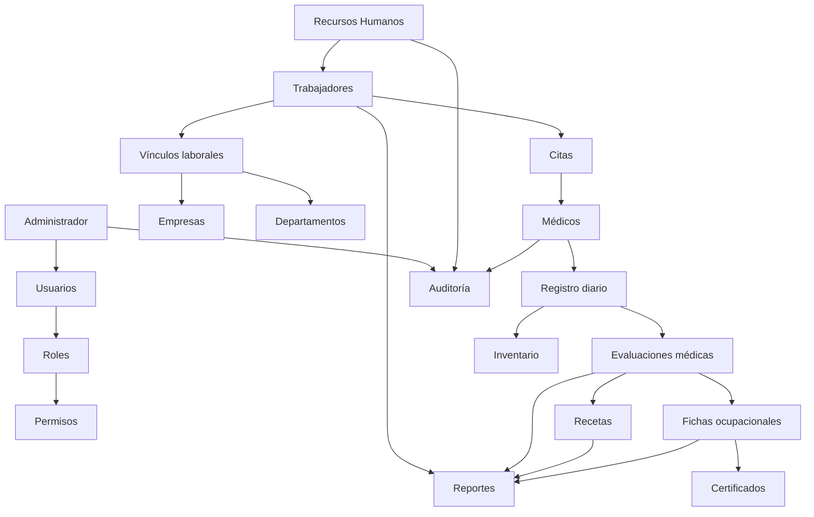

# Flujo general

El administrador administra usuarios, roles y permisos. RRHH registra identidad y contexto laboral. El médico atiende, documenta y emite documentos autorizados. La auditoría registra las operaciones relevantes. Véanse [[CITAS_Y_ATENCION]], [[FLUJO_CLINICO]] e [[INVENTARIO]].
