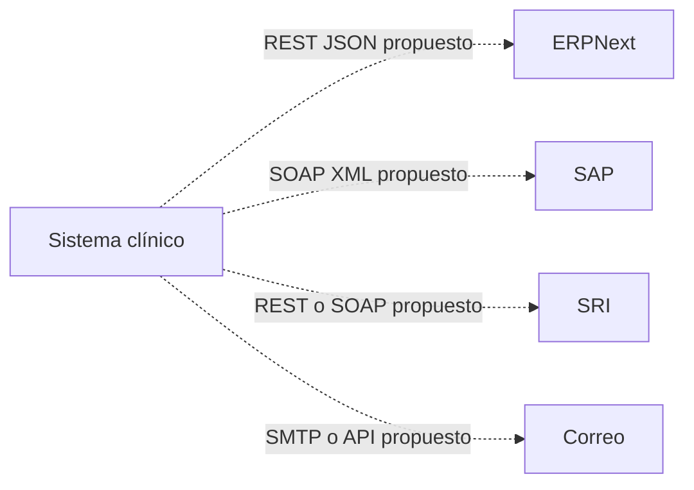

# Integraciones

No hay integraciones externas activas documentadas. Este mapa describe contratos posibles: REST/JSON para APIs web, SOAP/XML para sistemas legados y webhooks para notificaciones entrantes. Cualquier integración futura debe validar autenticación, permisos, auditoría y datos mínimos. Véanse [[ARQUITECTURA]] y [[USUARIOS_ROLES_PERMISOS]].
