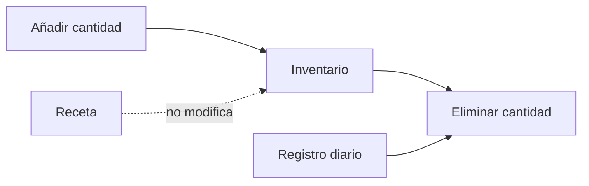

# Inventario

Cada cambio de stock genera un movimiento auditable. El registro diario puede consumir inventario al registrarse; una evaluación médica y una receta no lo modifican. El stock no puede ser negativo y las operaciones de cantidad requieren protección de concurrencia.

Cada medicamento nuevo registra su fecha civil de caducidad. El listado la identifica con un semáforo: rojo para vencidos o con hasta 3 meses, amarillo para más de 3 y hasta 6 meses, y verde para más de 6 meses. Los registros históricos que todavía no tengan fecha se muestran como pendientes de actualización, sin inventar información.

El detalle del medicamento muestra sus entregas efectivas a trabajadores desde el Registro diario: fecha, trabajador, cédula, empresa, número de registro, cantidad y profesional responsable. El historial identifica además el destinatario y el concepto de cada movimiento; las operaciones administrativas sin referencia clínica se presentan como movimientos manuales. Los borradores y registros anulados no se presentan como entregas vigentes.

Desde el detalle se puede descargar un PDF con el historial completo de movimientos. La exportación se genera en servidor, exige permiso de lectura de inventario y queda registrada en auditoría.

El módulo Reportes resume únicamente entregas físicas asociadas a movimientos `SALIDA` de Registro diario. Las recetas y los medicamentos indicados en evaluaciones no cuentan como entregas. Una atención anulada queda fuera del total neto porque su devolución y cambio de estado se realizan en la misma transacción. La agregación conserva separadas las unidades incompatibles y aplica el contexto histórico y empresarial autorizado del registro.

Véanse [[FLUJO_CLINICO]] y [[BASE_DE_DATOS]].
