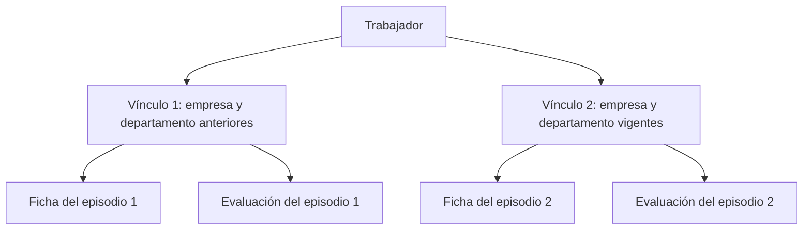

# Trabajadores y vínculos

Un trabajador puede tener varios vínculos laborales y una asignación vigente. Si en la semana 1 perteneció a Sistemas y en la semana 2 a Marketing, la ficha anterior conserva Sistemas y la nueva muestra Marketing. No se reescriben documentos históricos. Véanse [[FLUJO_CLINICO]] y [[BASE_DE_DATOS]].
