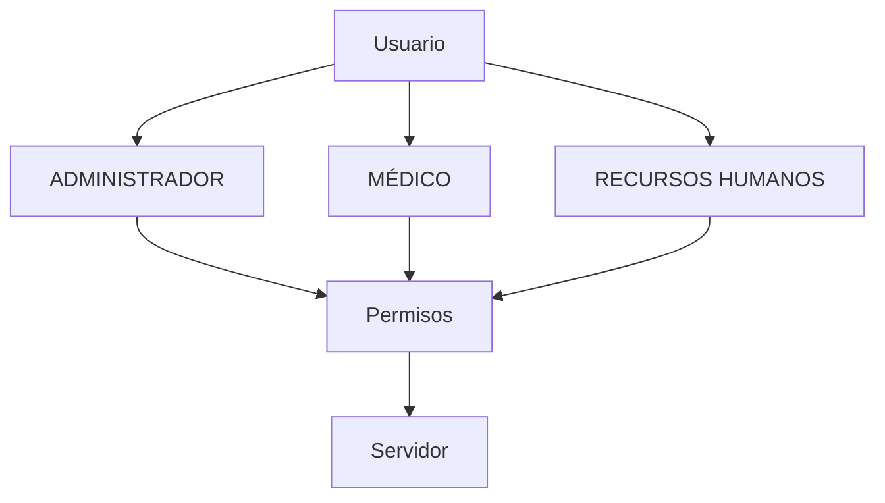

# Usuarios, roles y permisos

Los roles válidos son `ADMINISTRADOR`, `MÉDICO` y `RECURSOS_HUMANOS`. Cada usuario tiene exactamente un rol; varios usuarios pueden compartirlo y varios médicos pueden trabajar simultáneamente. Los permisos se validan en servidor; la interfaz solo representa el resultado. Véanse [[CITAS_Y_ATENCION]] y [[FLUJO_CLINICO]].
